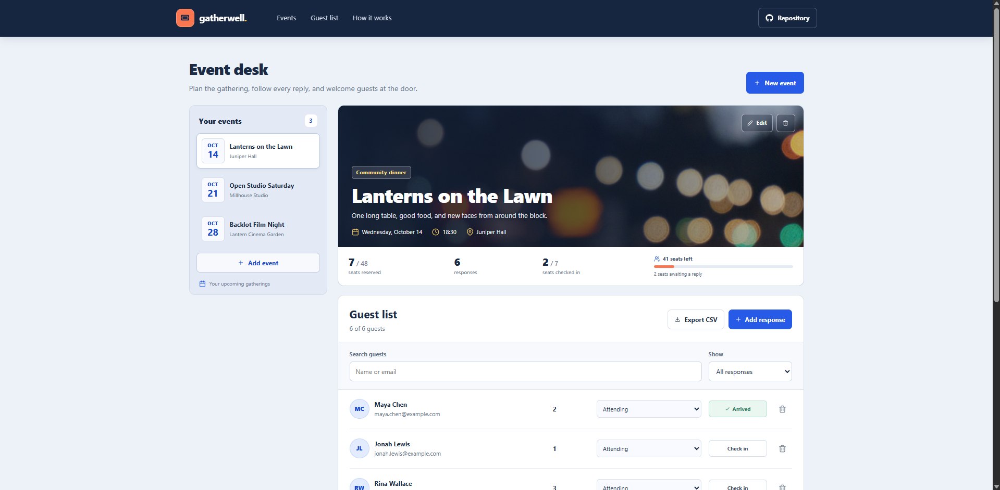

# Gatherwell | Event RSVP Manager

Gatherwell is an event organizer's desk for planning a gathering, recording guest replies, and checking people in at the door.

**Live demo:** [a2rp.github.io/event-rsvp-manager](https://a2rp.github.io/event-rsvp-manager/)

## What is included

- Three sample events with dates that stay current, example guest responses, venue details, and capacity.
- A fixed header with links to the event list, guest list, and usage notes, plus the public GitHub repository.
- An event list with a date tile and venue for each event. Select an event to view and manage its guests.
- A featured event panel with its date, start time, venue, description, category, seat use, response count, and arrivals.
- An event form to create or edit an event name, description, category, date, time, venue, and capacity.
- A guest form to record a name, email address, RSVP response, and party size.
- A searchable guest list with response filters, editable response status, arrival check-in, guest removal, and CSV export.
- A custom confirmation dialog before removing an event or guest.
- A footer with the local logo, current year, profile and support links, and the source repository.
- A floating Back to top button that appears after scrolling more than 50 pixels.

## How to use it

### Choose or create an event

Select an event from **Your events** to open its details and guest list. Choose **New event** or **Add event** to create an event. Add its name, description, type, date, start time, venue, and guest capacity. Select **Edit** on the event panel to change these details later.

### Record guest responses

Choose **Add response** and enter the guest's name, email, response, and the number of seats in their party. An email address can only be added once per event. Attending guests count toward the event capacity. The form explains when an RSVP cannot be saved because there are not enough seats.

Use the response menu in the guest list to change an RSVP. The same capacity rule applies when changing a guest to **Attending**. Guests with an **Attending** response can be checked in when they arrive. Changing a checked-in guest to **Maybe** or **Declined** clears the check-in mark.

### Search, filter, export, and remove

Search by a guest's name or email address. Use the response selector to show everyone, attending guests, guests who may attend, or declined guests. **Export CSV** downloads the complete guest list for the selected event, including names, email addresses, responses, seat counts, and check-in state.

Use the trash icon beside a guest, or **Delete event** on the event panel, to open a confirmation dialog. The dialog names the item being removed. Choose **Keep it**, click outside, or press Escape to cancel. Focus starts on the safe action and stays within the dialog. Removing an event also removes its guest list from this browser.

## How the data is stored

This is a frontend demonstration with no server, account system, or shared database. Events and guest responses are saved in the current browser's local storage. They remain on the same device and browser after a refresh, but do not sync to other visitors. The events and guest lists present on first visit are example data. Clearing this site's browser storage restores those examples.

Guest email addresses and RSVP details are entered and kept locally in this browser. This demo does not send invitations or emails, and its guest records are not private or backed up to a service. Use sample details while evaluating the interface.

## Run locally

Install the project packages and start the Vite development server:

```bash
npm install
npm run dev
```

Open the local URL printed in the terminal. The app uses React, Vite, React Icons, and CSS Modules. Picsum event artwork is saved under `public/images` and served locally by the app.

## Lint and production build

Run ESLint and build the production files with:

```bash
npm run lint
npm run build
```

The production build is written to `dist`. Source maps are disabled.

## Deploy

The site is published from the `gh-pages` branch. To build and publish the latest version, run:

```bash
npm run deploy
```

The `predeploy` script runs the production build first. The deploy command then publishes the contents of `dist`. Vite uses `/event-rsvp-manager/` as the project site base path.

## Where it can be used

Gatherwell can demonstrate an event planning and check-in workflow, or act as a starting point for a small organizer's RSVP tool. In its current form, it is suitable for a local demo with sample data. Real invitations shared among different people need a server, account controls, and a shared data store.

## Future improvements

These are ideas for later work and are not included in the current app:

- Add a server and shared database so organizers can share events and guest lists.
- Create public RSVP links so invitees can reply without an organizer recording the response.
- Add accounts, organizer permissions, and invitation email or reminder delivery.
- Add calendar export, event image upload, and attendance reports.

## Links

- Portfolio: [https://www.ashishranjan.net](https://www.ashishranjan.net)
- GitHub: [https://github.com/a2rp](https://github.com/a2rp)
- CodePen: [https://codepen.io/ash1198](https://codepen.io/ash1198)
- LinkedIn: [https://www.linkedin.com/in/aashishranjan](https://www.linkedin.com/in/aashishranjan)
- Facebook: [https://www.facebook.com/theash.ashish/](https://www.facebook.com/theash.ashish/)
- YouTube: [https://www.youtube.com/@ashishranjan-ashz?sub_confirmation=1](https://www.youtube.com/@ashishranjan-ashz?sub_confirmation=1)
- Email: [mailto:ash.ranjan09@gmail.com](mailto:ash.ranjan09@gmail.com)
- Source code: [https://github.com/a2rp/event-rsvp-manager](https://github.com/a2rp/event-rsvp-manager)

## Support

- Support: [https://a2rp-donation-page.netlify.app/](https://a2rp-donation-page.netlify.app/)
- Buy Me a Coffee: [https://buymeacoffee.com/ashishranjan](https://buymeacoffee.com/ashishranjan)
- Patreon: [https://www.patreon.com/ashishranjan](https://www.patreon.com/ashishranjan)
